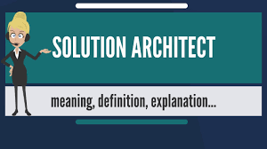

## What is this?

A collection of super-popular Interview questions, along with answers, and some code-snippets that will help you to prepare for technical interviews. Many of these questions are real questions from real interviews. It is by no means comprehensive, and the answers are relatively short ( and for each of the concepts, there are probably better and/or more in depth coverage in the web), but this repo like reference tool, that helps you to prepare for technical interview.

**Disclaimer** : The views expressed and the content shared are those of the author and dont reflext the views of the author's employer or cloudnloud platform

**we are not making any $$$ from it.Just helping community to share the knowledge.**

We collate the information in this repository through students submissions , if anyone finds the exact content elsewhere and from other authors, please reach out to us on **info@cloudnloud.com** and we will give appropriate credits in our content.

## Table of Contents

## Interview Questions

# Linux

<!-- ALL-TOPICS-LIST:START -->
<!-- prettier-ignore-start -->
<!-- markdownlint-disable -->

<table>
  <tr>
    <td align="center"><a href="/linux/README.md"> <b>Linux</b></a></td>
   
  </tr>
  
</table>

<!-- markdownlint-enable -->
<!-- prettier-ignore-end -->
<!-- ALL-TOPICS-LIST:END -->

# Cloud

<!-- ALL-TOPICS-LIST:START -->
<!-- prettier-ignore-start -->
<!-- markdownlint-disable -->

<table>
  <tr>
    <td align="center"><a href="/aws/README.md"> <b>AWS</b></a></td>
    <td align="center"><a href="/azure/README.md"> <b>AZURE</b></a></td>

  </tr>
 
</table>

<!-- markdownlint-enable -->
<!-- prettier-ignore-end -->
<!-- ALL-TOPICS-LIST:END -->

# DevOps

<!-- ALL-TOPICS-LIST:START -->
<!-- prettier-ignore-start -->
<!-- markdownlint-disable -->

<table>
  <tr>
    <td align="center"><a href="/devops/README.md"> <b>DevOps</b></a></td>
   
  </tr>
  
</table>

<!-- markdownlint-enable -->
<!-- prettier-ignore-end -->
<!-- ALL-TOPICS-LIST:END -->

# DevOps - Automation

<!-- ALL-TOPICS-LIST:START -->
<!-- prettier-ignore-start -->
<!-- markdownlint-disable -->

<table>
  <tr>
    <td align="center"><a href="/ansible/README.md"> <b>Ansible</b></a></td>
	<td align="center"><a href="/terraform/README.md"> <b>terraform</b></a></td>
   
  </tr>
  
</table>

<!-- markdownlint-enable -->
<!-- prettier-ignore-end -->
<!-- ALL-TOPICS-LIST:END -->

# Docker

<!-- ALL-TOPICS-LIST:START -->
<!-- prettier-ignore-start -->
<!-- markdownlint-disable -->

<table>
  <tr>
    <td align="center"><a href="/docker/README.md"> <b>Docker</b></a></td>
   
  </tr>
  
</table>

<!-- markdownlint-enable -->
<!-- prettier-ignore-end -->
<!-- ALL-TOPICS-LIST:END -->

# Kubernetes

<!-- ALL-TOPICS-LIST:START -->
<!-- prettier-ignore-start -->
<!-- markdownlint-disable -->

<table>
  <tr>
    <td align="center"><a href="/kubernetes/README.md"> <b>Kubernetes</b></a></td>
   
  </tr>
  
</table>

<!-- markdownlint-enable -->
<!-- prettier-ignore-end -->
<!-- ALL-TOPICS-LIST:END -->

# Python - Automation

<!-- ALL-TOPICS-LIST:START -->
<!-- prettier-ignore-start -->
<!-- markdownlint-disable -->

<table>
  <tr>
    <td align="center"><a href="/python/README.md"> <b>Python</b></a></td>
   
  </tr>
  
</table>

<!-- markdownlint-enable -->
<!-- prettier-ignore-end -->
<!-- ALL-TOPICS-LIST:END -->

# Data

<!-- ALL-TOPICS-LIST:START -->
<!-- prettier-ignore-start -->
<!-- markdownlint-disable -->

<table>
  <tr>
    <td align="center"><a href="/data/README.md"> <b>Data</b></a></td>
   
  </tr>
  
</table>

<!-- markdownlint-enable -->
<!-- prettier-ignore-end -->
<!-- ALL-TOPICS-LIST:END -->

# Solution Architect

<!-- ALL-TOPICS-LIST:START -->
<!-- prettier-ignore-start -->
<!-- markdownlint-disable -->

<table>
  <tr>
    <td align="center"><a href="/solution-architect/README.md"> <b>Assesment</b></a></td>
	<td align="center"><a href="/solution-architect/README.md"> <b>Technology</b></a></td>
    
  </tr>
  
</table>

<!-- markdownlint-enable -->
<!-- prettier-ignore-end -->
<!-- ALL-TOPICS-LIST:END -->

# MongoDB

+ [Explore MongoDB](./mongodb/mongodb.md)

# GIT - Source Code Management

+ [Explore GIT](./git/git.md)

### Find All Cloud/DevOps Architect Trainings with Step-by-Step Handson with Use cases:
- Click below Picture 👇

<h3 align="left">Connect with Me:</h3>

<h3 align="left">Connect with Us to know your talents:</h3>

# Speak to us in our Discord channel

<h3 align="left">Speak to us in our #techsupport channel for all your support/queries need ?:</h3>

